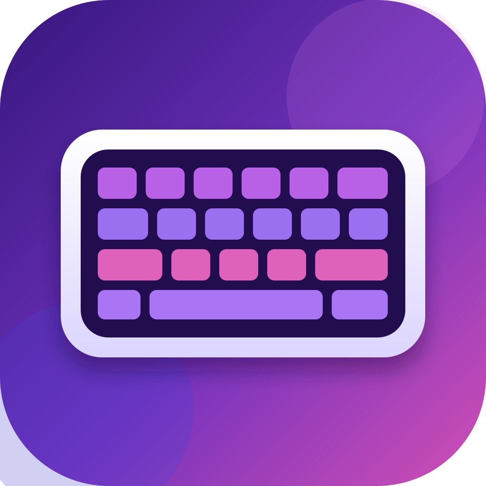

# Ajazz Keyboard



**Ajazz Keyboard** is a small, native macOS companion app for the **AJAZZ AK820 Pro**. It brings the essentials of keyboard customization to the Mac: RGB lighting, clock synchronization, and animated GIF uploads for the keyboard's built-in display.

It is designed to be simple, private, and pleasant to use. There is no Windows virtual machine, no browser dashboard, no account, and no network connection involved—the app communicates with the keyboard over USB.

## Highlights

- Control RGB lighting effects, color, brightness, speed, and direction.
- Sync the clock shown on the keyboard display.
- Send animated GIFs to the 128 × 128 keyboard screen.
- Preview the processed image before uploading it.
- Choose how a GIF fits the display: **Fill**, **Show all**, or **Stretch**.
- Automatically handles the display orientation used by the AK820 panel.
- Keeps the interface compact in the macOS menu bar.
- Optionally launches automatically when you sign in to your Mac.

## Requirements

- macOS 14 Sonoma or later
- AJAZZ AK820 Pro
- A USB cable connected directly to the keyboard

GIF uploads should be performed while the keyboard is connected by cable. Bluetooth is not currently supported, and 2.4 GHz receiver behavior may vary between firmware versions.

## Installation

1. Download `Ajazz-Keyboard-<version>.dmg` from the project's GitHub Releases page.
2. Open the DMG and drag **Ajazz Keyboard** to **Applications**.
3. Open the app from Applications. It lives in the menu bar—click the keyboard icon to reveal the controls.
4. If macOS shows a security warning for an unsigned build, Control-click the app, choose **Open**, then confirm **Open**.

The current release package is locally signed but not notarized. A Developer ID–signed and notarized build is recommended before broad public distribution.

## Using the app

### RGB lighting

Open the **Color** tab to select an effect and adjust its color, brightness, speed, and direction. Rapid color changes are consolidated so the keyboard receives the final choice instead of an outdated one.

### Clock

Open the **Clock** tab and choose **Sync clock** to set the keyboard display to your Mac's current date and time.

### Display GIFs

1. Open the **GIF** tab.
2. In Finder, select a `.gif` file and press <kbd>⌘C</kbd>, or use **Paste GIF from Finder** in the app.
3. Select a fitting mode and check the preview.
4. Choose **Send to keyboard** and wait for the completion message.

The app converts every GIF to the display's 128 × 128 RGB565 animation format. It supports animations of up to 30 frames; longer GIFs are sampled down to that limit.

While a GIF is being sent, unrelated controls are temporarily disabled to prevent two configuration operations from being sent to the keyboard at once.

## Known display limitation

On some AK820 firmware versions, GIF uploads with **fewer than 25 frames** can successfully finish and be saved, while the keyboard's physical display remains stuck on a **Loading** percentage (commonly around 76%). This is a keyboard/USB transport behavior on macOS, not a corrupted GIF: after reconnecting the keyboard, the newly uploaded animation is shown correctly.

**Workaround:** after the app reports that the GIF upload has completed, unplug and reconnect the keyboard's USB cable (or power-cycle the keyboard). The new GIF remains saved and should load normally after reconnecting.

The app intentionally does not report an upload failure in this case, because the animation data has been written to the keyboard successfully. A direct USB driver path is being investigated for a future release to remove the need for this reconnect.

## Build from source

The project is a Swift Package and requires Xcode 26 / Swift 6.

```sh
git clone <repository-url>
cd AK820Mac
swift run AK820Mac
```

You can also open `Package.swift` in Xcode and run the `AK820Mac` scheme on **My Mac**.

## Creating a release

Run the packaging script on a Mac:

```sh
./Scripts/make-release.sh 1.0.0
```

This creates universal Apple Silicon and Intel builds in `dist/`:

- `Ajazz-Keyboard-1.0.0.dmg` — drag-and-drop installer
- `Ajazz-Keyboard-1.0.0.zip` — portable archive

## Privacy

Ajazz Keyboard does not collect data, require an account, or send keyboard data over the network. All processing—including GIF conversion—happens locally on your Mac.

## Contributing

Bug reports, keyboard firmware observations, and pull requests are welcome. When reporting a display issue, please include your macOS version, connection type, keyboard firmware version if available, and the number of GIF frames involved.
